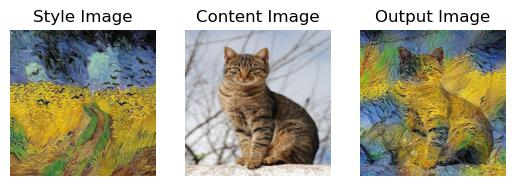

# Style Transfer

This program allows to transfer a style into the given image as in the example:



## Environment

In the file `requirements.txt` are listed needed libraries. You can install them for example using PIP:

```shell
pip install -r requirements.txt
```

## Usage

### Data

First, you should create your folder in directory `data/`. This created folder should contain two images:

* `content.jpg` - file with the content image
* `style.jpg` - file with the style image

### Execution

```shell
python run.py <name_of_your_folder>
```

### Advanced options

If you want to change parameters of the neural network you can change it in the file `run.py`

* `content_weight` - the weight of the content loss in the calculation of the total loss during training
* `style_layers` - list of layers from which the output features are taken for the style lost calculation (default all of the layers are taken: `[0, 1, 2]`)
* `content_layers` - list of layers from which the output features are taken for the conent lost calculation (default only the last layer is taken: `[2]`)

Image size is default **256 x 256**, but you can change it adding argument `imsize` when calling the function `get_images` in the file `run.py`.
